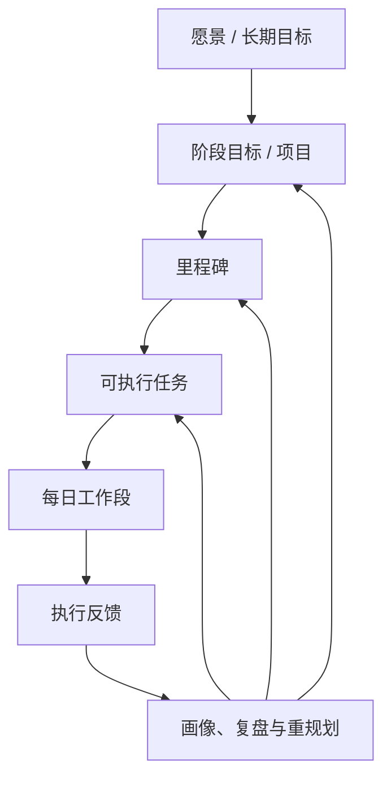

# Repland 理想形态：计划表功能蓝图

> 本文描述 Repland 在最终理想形态下的“计划表”能力：从目标、项目、任务到具体时间段的完整规划、执行和调整系统。它不是当前版本功能清单，也不受 MVP 的单设备、30 天规划窗口或功能范围限制。

## 1. 计划表的最终定位

Repland 的计划表不应只是把待办事项放进日历，而应成为一个能够理解目标、约束、任务价值、个人节奏和现实变化的动态行动系统。

它要持续回答四个问题：

1. **现在最值得做什么？**——给出可信、可解释的优先任务。
2. **什么时候做最合适？**——在真实可用时间中安排合理的工作段。
3. **计划做不完时如何取舍？**——明确暴露容量问题，提供多个方案供用户选择。
4. **现实变化后怎样继续推进？**——根据执行反馈和新事件，让计划平稳地重建而不失控。

最终的计划表应从“静态日程展示”升级为“目标—任务—时间—反馈—再规划”的闭环中枢。

## 2. 计划层级：从长期目标到当下行动

计划表需要同时支持不同时间尺度，且上下能够追溯。

| 层级 | 解决的问题 | 典型内容 |
| --- | --- | --- |
| 长期目标 | “我想在未来实现什么？” | 考研、竞赛获奖、技能提升、健康改善。 |
| 项目/阶段目标 | “这段时间要推进哪件大事？” | 完成课程设计、备赛、论文写作、求职准备。 |
| 里程碑 | “做到什么程度算阶段性完成？” | 提交初稿、完成知识模块、完成作品 Demo。 |
| 任务 | “下一步具体要做什么？” | 查资料、写 1 000 字、调试功能、复习一章。 |
| 工作段 | “今天何时投入多少时间？” | 19:00–20:30 写论文、20:40–21:10 整理错题。 |

用户既可以从长期目标逐层拆解，也可以先快速记录零散任务，再由系统建议将其归入已有项目、里程碑或目标。任何自动归类均应可查看、可修改、可忽略。

## 3. 统一计划数据模型

最终计划表应统一管理以下对象，避免课程、日程、任务、目标和提醒彼此割裂。

### 3.1 任务对象

每个任务可包含：

- 名称、描述、类别、所属项目和关联目标；
- 初始优先级、截止日期、预计时长、期望完成周期；
- 完成定义、可拆分性、最小可执行时长和推荐工作方式；
- 前置依赖、可并行关系、所需地点/工具/资料；
- 用户锁定、暂停、委托、取消、替换等状态；
- 实际用时、完成进度、执行结果、延期原因和复盘记录。

### 3.2 时间对象

计划表应将时间分为四类：

| 时间类型 | 含义 | 例子 |
| --- | --- | --- |
| 不可占用时间 | 不应被普通任务自动排入的时间 | 课程、会议、通勤、睡眠、已确认日程。 |
| 受保护时间 | 用户明确希望保留给特定事项的时间 | 固定自习、运动、家庭时间、深度工作时段。 |
| 可规划时间 | 系统可用来安排任务的时间 | 晚间空档、周末上午、课间碎片时间。 |
| 弹性缓冲时间 | 用于吸收估时误差和临时变化的时间 | 每日机动时段、周度补偿块。 |

计划表可以在用户授权后同步多日历、课程表和外部事件，但必须清楚标识数据来源、同步状态与冲突原因，并支持对任何来源单独关闭同步。

### 3.3 计划版本对象

每一次确认的计划都应形成可追溯版本，保存当时的任务排序、时间段、约束、容量判断和调整原因。回退历史版本时创建新的当前版本，而不抹去后续的执行记录。

## 4. 多视图计划表

同一份计划数据应通过不同视图回答不同问题，用户不需要在多个互不相通的页面重复维护任务。

| 视图 | 核心用途 | 关键内容 |
| --- | --- | --- |
| 今日行动视图 | 快速进入执行状态 | 当前工作段、下一件事、预计时长、开始入口、临近风险。 |
| 时间轴日程视图 | 回答“今天何时做什么” | 按时间排列的课程、固定事件、任务段、空档与缓冲。 |
| 周计划视图 | 平衡一周的学习、生活和项目 | 每日负载、截止分布、类别占比、可用容量和周度目标。 |
| 月度/学期视图 | 识别长期压力和里程碑 | 考试周、项目节点、长周期任务和高压时段。 |
| 优先任务队列 | 回答“接下来优先做什么” | 动态优先级、截止风险、预估投入、排序原因和待定任务。 |
| 项目路线图 | 管理目标与阶段推进 | 里程碑、依赖关系、实际进度、关键路径和延期风险。 |
| 复盘与历史视图 | 观察计划质量与执行规律 | 计划版本、实际完成情况、偏差、调整轨迹和趋势。 |

## 5. 智能规划引擎

### 5.1 规划输入

规划不只看任务优先级。理想的规划引擎需要综合：

- 用户的长期目标、阶段目标和当前项目；
- 任务截止日期、完成定义、预计工作量和依赖关系；
- 课程、会议、休息、通勤、已锁定日程和可用时间；
- 用户的初始优先级、类别偏好和手动排序习惯；
- 历史实际耗时、完成率、容易中断时段、专注偏好和学习结果；
- 新增任务、突发事件、延期、部分完成等实时变化；
- 用户对睡眠、休息、运动、社交等生活边界的明确约束。

### 5.2 排序逻辑

规划器采用“硬约束优先、软目标优化、用户决定兜底”的原则。

**硬约束**包括：固定课程和日程、用户锁定时间、任务前置依赖、明确截止时间、最小休息与健康边界等。普通任务不能自动与硬约束重叠。

**软目标**包括：用户初始优先级、目标关联度、截止风险、任务价值、类别平衡、预估难度、延期风险、切换成本、用户精力曲线和长期收益。系统可根据这些因素生成动态优先级，但必须让用户看见关键原因，而非只显示黑盒分数。

### 5.3 时间段安排

理想排程不应机械地把任务塞满空闲时间，而应：

- 根据任务性质选择深度专注块、短时碎片块或分段推进；
- 在用户精力较高的时间优先安排高认知负荷任务；
- 把地点、工具和上下文相近的任务适度聚合，降低切换成本；
- 为估时误差、通勤、突发事务和恢复留出缓冲；
- 将大型任务拆为有明确完成条件的工作段，并保留整体进度；
- 在任务之间合理安排休息、复习、回顾和恢复，避免长期透支；
- 对没有可靠时长、截止日期或可用时间的任务保留在优先队列中，而不是伪造精确日程。

## 6. 容量分析与冲突决策

计划表必须主动说明“是否做得完”，而不是在排不下时悄悄覆盖任务。

### 6.1 可行性分析

系统应持续比较可用容量与任务需求，展示：

- 某日、某周、某项目周期的剩余可用时间；
- 已承诺工作量、缓冲时间和未分配工作量；
- 即将无法按期完成的任务或里程碑；
- 造成风险的主要因素，如截止冲突、估时不足、依赖阻塞或任务过度堆积；
- 在不同完成标准下的可行性，例如“保底完成”“标准完成”“冲刺完成”。

### 6.2 冲突方案

当容量不足、任务冲突或突发事项出现时，系统应生成多套可比较方案，而不是给出单一命令：

| 方案类型 | 系统动作 | 用户需要决定的内容 |
| --- | --- | --- |
| 保留原计划 | 不改变既有承诺 | 接受新任务待定或延后处理。 |
| 轮换推进 | 压缩每项任务的日投入 | 哪些任务可以降低当日进度。 |
| 延期/重排 | 调整受影响任务的未来时段 | 哪些截止日期或安排可以变动。 |
| 拆分任务 | 将大任务切成可执行工作段 | 认可拆分方式和完成标准。 |
| 降低目标 | 保留核心成果，减少非关键工作 | 接受何种“最小可交付结果”。 |
| 放弃/替换 | 从未来计划移除低价值事项 | 确认取消或创建替代任务。 |

每套方案都应说明受影响任务、时间变化、收益、风险和不可逆影响。用户可以手动编辑后确认，也可在明确的单次授权范围内让 AI 在多个可接受方案中代为选择。

## 7. 执行反馈驱动的动态重规划

### 7.1 反馈方式

用户完成或中断一个工作段后，可以用极低成本记录：完成、部分完成、延期、取消、替换；也可按需补充实际用时、完成内容、进度、困难、结果和延期原因。

系统不得把“时间已到”“用户没有点击”自动理解为任务完成或失败。状态和结果始终以用户确认的信息为准。

### 7.2 重规划策略

反馈、新任务、日程变动、优先级调整和目标变化都可以触发重规划分析。理想形态下，系统应做到：

- 优先保留用户已锁定、即将开始和手动确认的重要安排；
- 仅调整真正受影响的未来部分，避免计划无理由大幅跳动；
- 在变更前提供清晰预览，展示哪些任务被移动、拆分、延后或降级，以及为什么；
- 用户确认后才更新当前计划；
- 用户预先允许的低风险机械调整（如在同一日缓冲时间内顺延）也应有明确策略、可撤销记录和可随时关闭的开关；
- 多次延期时，帮助用户重新评估任务目标、难度和方法，而非通过不断提高优先级制造压力。

## 8. 个性化与长期学习

在用户明确同意并可随时查看、修正的前提下，系统可逐步学习真正有助于规划的模式：

- 不同类别任务的实际耗时与估时误差；
- 不同时间段的专注度、完成率和中断概率；
- 更适合连续专注、短时推进或分散复习的任务类型；
- 用户对任务排序、休息、工作量和生活平衡的真实偏好；
- 学习任务的知识薄弱点、复习间隔和成绩反馈；
- 高压力周期下的可承受工作量与需要保留的恢复空间。

这些画像应只用于改进建议，不应把用户固化为不可改变的标签。任何画像结论都应提供证据来源、置信程度和“忽略/修正/删除”入口。

## 9. 计划提醒与行动支持

提醒的目的不是催促，而是让用户在恰当时刻低成本地回到计划。

- 工作段开始前：提示任务目标、所需资料和预计投入；
- 工作段结束后：邀请用户用一次点击确认结果或稍后补充反馈；
- 截止风险出现时：提前说明风险与可选调整方案；
- 计划长期偏离时：建议进行一次简短重规划，而不连续制造干扰；
- 每日/每周回顾时：展示完成情况、未完成工作、负载变化和下一阶段建议；
- 支持提醒强度、时段、渠道和免打扰规则的个性化配置。

## 10. 协同、同步与跨设备能力

在理想形态中，计划表可从个人规划扩展到可控的协同场景：

- 跨设备实时同步与离线优先编辑；
- 从课程系统、日历、邮件或消息中提取待确认的日程/任务建议；
- 与队友共享项目里程碑、协作任务和可用时间，但不默认暴露个人完整日程；
- 在团队计划中区分个人任务、共享任务、负责人、依赖关系和交付节点；
- 支持授权范围、可见范围、同步来源和数据保留期限的细粒度管理。

外部数据进入计划表前应经过用户确认；来自外部服务的变化不应绕过用户直接改写个人任务状态或核心计划。

## 11. 用户控制、可解释性与安全边界

无论智能能力发展到何种程度，最终计划表都应遵守以下底线：

1. 用户的目标、初始优先级、手动排序和锁定安排不能被 AI 静默覆盖。
2. AI 生成的排程、拆分、估时和取舍均应展示理由、影响范围和可编辑入口。
3. 任务完成、延期、取消、替换及现实结果必须由用户确认。
4. 每次实质性重规划都必须可以查看历史、比较差异和恢复版本。
5. 数据默认最小化收集；外部同步、联网 AI 和行为画像均需明确授权。
6. AI 不可用时，计划表仍应以本地、可解释的规则维持基础工作能力。

## 12. 理想用户体验示例

小王周三晚上临时收到一份三天后截止的作业，同时周末还有竞赛 Demo、英语复习和已预约的社团活动。她只需录入新作业并标注截止日期，Repland 即会：

1. 读取她已确认的课表、已有任务、锁定安排和本周剩余容量；
2. 判断现有计划在不调整的情况下无法同时满足全部截止任务；
3. 给出“保留社团活动但压缩竞赛任务”“推迟社团活动”“将作业拆分并使用周末缓冲”等方案；
4. 说明每个方案影响的时间段、任务进度和风险；
5. 在她确认方案后，将作业拆为多个工作段，保留其他任务的身份、进度和历史；
6. 她完成其中一个工作段后，根据实际用时与进度，仅调整受影响的后续部分；
7. 周末复盘时，系统总结她对同类作业的实际耗时，作为未来估时与安排的参考。

整个过程中，系统承担分析、模拟和重排的劳动；目标取舍、任务状态和最终计划始终由用户掌握。

## 13. 一句话定义

**Repland 的理想计划表，是一个以用户目标为起点、以真实时间和执行反馈为依据、能够解释取舍并持续重规划的个人行动操作系统。**
