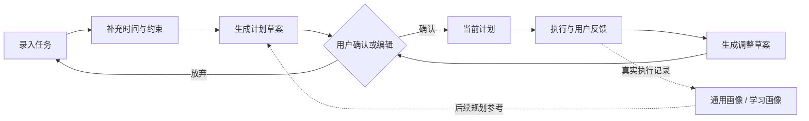

# Repland 当前项目核心功能说明

> 版本定位：中文 Android 单设备个人任务规划 MVP。项目以“录入任务—生成计划—执行反馈—动态调整”为核心闭环，目标是帮助大学生在课程、学习、事务和休闲并行时，低成本地形成可执行、可调整的计划。

本文依据 `README.md`、`REPLAND_IDEA.md` 与 `CONTEXT.md` 整理。其中，产品规则以 `CONTEXT.md` 和 `README.md` 为准；“已具备基础实现”仅指仓库当前已经明确说明的能力，其余内容为 V1 已确认方向，仍在持续完善。

## 1. 核心规划闭环

Repland 不是一次性生成计划的聊天工具，也不只是待办清单。用户首先录入任务与时间限制，系统生成一份可查看的计划草案；用户确认或编辑后，草案才成为当前计划。用户执行任务并提交真实反馈后，系统据此再次生成调整建议，形成持续重规划的闭环。

核心原则是：AI 可以分析、建议和解释，但不能自动替用户确认任务完成、取消任务或静默替换现有计划。

## 2. 任务收集与任务生命周期

### 2.1 快速创建任务

- 创建任务的最低信息为：任务名称或任务描述、任务类别、初始优先级。
- 若用户只有任务描述，AI 可以生成可编辑的任务名称；若已有名称，系统不会覆盖。
- 可选信息包括截止日期、预计完成周期、预计总时长和长期目标背景。缺少时长或可用时间的任务仍可保存并参与排序，但会处于“待安排”状态，不会被强行分配具体时间段。
- MVP 预置四类任务：课内学习、课外学习、办公事务、休闲娱乐；默认类别偏好权重分别为 30%、25%、25%、20%，用户可自行调整。

### 2.2 状态与历史保留

- 任务状态包含未开始、进行中、已完成、已延期、已取消和已替换。
- 已确认计划的时间段开始时，任务可自动变为“进行中”；任务是否完成、延期、取消、替换仍必须由用户确认。
- 已取消和已完成任务不会硬删除，用户可恢复它们进入新的规划分析，同时保留此前的执行记录。
- “替换任务”会保留原任务及其历史，并创建一个新的任务身份，而非直接覆盖旧任务。

## 3. 时间约束与可用时间管理

- 用户可配置每周重复的课程、休息等不可用时间，并可为某一天单独设置可用或不可用例外。
- 课表可从本地 PDF 导入，导入结果需经用户核对或修正后，才会成为固定约束。
- 用户标记为“不可避免”的任务、已锁定的时间段、课程和休息时间均属于 AI 必须遵守的硬约束。
- 用户第一次使用时不必先填写课表或休息模板；在缺少足够可用时间信息时，系统只提供可排序的任务清单，不假设用户空闲，也不生成不可靠的具体排程。

## 4. 动态优先级与计划生成

### 4.1 动态排序

每个任务保留用户设置的初始优先级（不可避免、高、中、低），同时在计划中展示会变化的动态优先级。动态优先级的软排序结构如下：

| 因素 | 权重 | 作用 |
| --- | ---: | --- |
| AI 任务规划适配度 | 45% | 评估任务难度、预计投入、适合连续完成或拆分完成等。 |
| 用户初始优先级 | 25% | 保留用户对重要程度的直接判断。 |
| 任务类别偏好 | 15% | 体现用户对不同生活领域的长期偏好。 |
| AI 情境判断 | 15% | 综合截止临近、延期次数、任务影响、通用画像和学习画像等信息。 |

硬约束与容量可行性不属于上述软权重。用户的初始优先级始终可见，不会被动态优先级静默改写；每次排序变化应向用户说明主要原因。

### 4.2 计划草案与时间段排程

- 系统会综合全部未完成任务、截止日期、可用时间、任务拆分需求与动态优先级，先进行全局规划，再生成每日安排，避免只按单日排序而影响后续截止任务。
- 自动排程以 30 分钟为最小单位，在滚动 30 天窗口内安排任务；跨天任务保持一个任务身份，可拆为多个每日工作段。
- 计划草案包含“下一步优先做什么”的排序任务清单；时间、时长等信息充分时，还会生成“何时做”的具体时间段计划。
- 用户可查看、编辑、确认或丢弃草案。未确认时，原有当前计划继续生效，也不会按草案发送提醒。
- 当所有任务无法在可用时间和截止日期内完成时，系统明确给出可行性预警，并建议轮换、延期、拆分、降低目标或放弃；系统不会静默删除或移动任务。

### 4.3 本地降级规划

联网 AI 不可用、返回异常或被用户关闭时，应用仍可通过本地、可解释的确定性算法生成基础排序与计划。此时 AI 专属评分取中性值，排序主要依据用户优先级、类别偏好、截止/逾期状态、延期次数和稳定的平局规则，并向用户提示高级 AI 评估暂不可用。

## 5. 多任务冲突处理与用户主动控制

- 新任务加入既有计划时，系统先保留现有计划与新任务，再生成说明冲突和影响范围的调整草案；不会静默挤占旧任务或丢弃新任务。
- 用户可以直接手动调整任务顺序和时间段。长按拖动形成的手动排序优先级高于 AI 当前建议；若可能造成截止日期或容量风险，系统只做非阻断提示。
- 用户可锁定已安排的时间段，AI 不会自动移动或与其重叠；用户仍可主动创建并行安排，并由系统提示执行风险。
- 当同一冲突存在多种可接受取舍时，用户可在**当前冲突范围内**选择“由 AI 决定”。这不是永久授权，结果仍会记录为可回退的新计划版本。

## 6. 执行反馈、复盘与重规划

### 6.1 真实反馈记录

- 在已结束的工作段中，系统显示“待确认”，由用户确认完成或延期；系统和 AI 不会推断状态。
- 用户可记录实际用时、完成内容、进度、完成结果，以及学习任务的学习结果或成绩。
- 部分完成会保留剩余工作，并生成后续调整草案；延期会记录事件、提高相关任务的动态紧迫度，但不会自动滚动到未来日期。
- 累计两次延期后，系统提示用户重新评估目标或做法，可选择继续、拆分、降低目标、调整截止日期、改变方法或取消，最终决定仍由用户做出。
- 支持对多个任务进行批量状态编辑，每个任务仍保留独立的执行记录。

### 6.2 每日回顾与画像

- 每日回顾可汇总已完成与未完成事项、实际耗时、进度、学习结果和下一步建议；跳过回顾不会导致系统擅自认定任务完成或失败。
- 用户的真实执行记录逐渐沉淀为通用画像和学习画像，用于改进未来的难度判断、时长估计、任务拆分和安排建议。
- 详细执行日志近期可查，历史数据可被汇总为长期规划证据；用户可检查、修正或删除不准确的 AI 结论。

## 7. 计划版本、日志与提醒

- 每次用户确认的计划都会保存为一个计划版本，包含任务排序、时间段和当时的任务状态。
- 恢复历史版本会创建一个新的当前版本，而不是删除原版本、后来版本或执行日志。
- 用户对状态和反馈的每一次确认都会形成执行日志；即使用户随后修正过去记录，原事件和更正事件也会一并保留。
- 本地提醒仅作用于已确认计划，包括具体时间段开始提醒、临近截止提醒和每日回顾提醒；没有截止日期或具体时间段的任务不会收到对应提醒。

## 8. AI 工作流、隐私与数据边界

- AI 通过结构化 Agent 工作流提供任务理解、难度与拆分建议、优先级建议、重规划方案和每日总结，而非以自由聊天作为核心交互。
- AI 输出属于建议数据，不能作为直接修改任务状态或自动执行计划的指令。
- 接入联网 AI 前必须取得用户明确同意；仅传输当前任务内容和必要、相关的结构化上下文，不默认上传无关本地数据或完整原始历史。
- 应用采用模型/服务商抽象层，用户无需选择模型；AI 关闭或不可用时，核心本地规划闭环仍可运行。
- MVP 为单设备、本地优先产品，不包含账号体系和跨设备同步；本地数据可由用户导出为 JSON。

## 9. 当前基础实现与后续完善边界

根据 README，仓库当前的 Android 基础实现已经覆盖以下内容：

- 使用 Kotlin、Jetpack Compose、Room 与协程构建本地 Android MVP。
- 提供“今日、任务、时间、我的”四个主要入口。
- 本地持久化任务、计划版本、每周时间块和单日例外。
- 支持基础任务状态与完成反馈、计划草案确认、历史计划查看与恢复。
- 支持本地 PDF 课表解析、导入预览确认，以及单双周等课程周次规则。
- 内置 30 分钟粒度、30 天滚动窗口的本地排程器。

以下为已确认的 V1 方向、正在持续完善的能力：完整动态优先级与 AI 评估、提醒机制、过去工作段审核、批量状态编辑、版本化执行日志、导出功能，以及更完整的回退语义。项目当前不以完整长期目标规划、习惯打卡、云端同步或自由聊天式 AI 为核心范围。

## 10. 一句话概括

**Repland 是一个由用户掌握最终决定权、以执行反馈驱动持续重规划的大学生个人任务规划智能体。**
