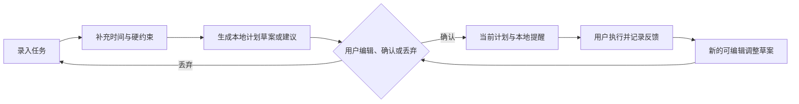

# Repland

> 将任务、现实约束和真实反馈转化为用户确认后才能执行的计划。

Repland 是面向中文用户的 Android 本地优先任务规划应用。它服务于需要在课程、学习、事务与休闲之间做取舍的人，尤其是刚进入大学、任务多而难以开始的用户。

当前版本为 **0.1.0**。它是单设备 MVP：无账号、无云同步、无分析 SDK，默认不发起联网 AI 请求。

## 当前状态

| 能力 | 状态 |
| --- | --- |
| 任务、执行反馈、更正日志 | 已实现，本地 Room 持久化 |
| 时间约束、课程 PDF 导入与预览 | 已实现 |
| 本地计划草案、编辑、确认、历史与回退 | 已实现 |
| 本地提醒、每日回顾、画像证据、JSON 导出与清除 | 已实现 |
| 受限 PlanningAgent、请求预览、输出校验、本地降级 | 已实现，使用 NoOp Advisor |
| 真实模型、网关、账号、同步 | 未实现 |
| DeepSeek BYOK 个人测试构建 | 已决策，尚未实现；绝不进入 `internal` 或 `release` |

完整交接、验证记录与下一步请读 [AI 开发交接](docs/AI_DEVELOPMENT_HANDOVER.md)。

## 用户闭环



系统可以帮助分析、排序和排程；用户始终决定任务状态和计划是否生效。

## 产品防线

- AI、规则与系统不会自动完成、延期、取消、替换任务，或静默修改用户初始优先级。
- AI 输出只能是建议或未确认草案；草案不会替换当前计划、创建提醒或删除历史。
- 课程、休息、固定任务、锁定时间段和不可避免任务是硬约束。
- 更正后的反馈优先用于后续规划，但原日志保留。
- AI 被关闭、服务未配置、断网、超时或输出无效时，继续使用确定性的本地规划。
- 当前 APK 没有 `INTERNET` 权限；不包含模型 Key、网络客户端或远程 AI 调用。

更完整的术语和规则以 [CONTEXT.md](CONTEXT.md) 为准。

## 本地 Agent

本地 `PlanningAgent` 仅支持类型化请求：任务理解、难度/时长、拆分、排序解释、重规划和每日总结。

```text
PreparingContext → AwaitingConsent → PreviewingRequest
→ RequestingAdvice → ValidatingAdvice
→ ShowingAdvice / ShowingDraft / FailedFallback
```

Compose 只显示和驱动工作流，不构建网络请求。`AiAdvisor` 是可替换的边界；当前注入 `NoOpAiAdvisor`，因此所有功能仍在设备本地完成。契约、最小化和校验要求见 [ADR 0001](docs/adr/0001-bounded-ai-advisor.md) 与 [AI 接入计划](docs/AGENT_AND_AI_INTEGRATION_PLAN.md)。

## 未来 AI 的两条路径

1. **正式产品路径**：Android 仅调用中国大陆受控网关；模型 Key 只存服务端。网关负责鉴权、限流、预算、审计和供应商隔离。进入开发前必须满足 [扩展准入门槛](docs/EXTENSION_READINESS.md)。
2. **个人开发测试例外**：计划中的 `byokDebug` 可使用用户自己的 DeepSeek Key，并且严格与正式构建隔离。它尚未实现，必须先满足交接文档列出的条款核验、Keystore、隐私同意、固定域名和测试门槛。

两条路径都不能绕过请求预览、输出校验、用户确认或本地失败降级。

## 代码结构

```text
android/
└── app/src/main/java/com/swan1127/repland/
    ├── data/       # Room、导出、PDF 课表导入
    ├── domain/     # 任务、时间、计划、AI 契约与 PlanningAgent
    ├── reminders/  # 已确认计划的本地提醒
    └── ui/         # Compose 页面和 ViewModel
docs/
├── AI_DEVELOPMENT_HANDOVER.md
├── AGENT_AND_AI_INTEGRATION_PLAN.md
├── EXTENSION_READINESS.md
├── PRIVACY.md
└── adr/0001-bounded-ai-advisor.md
```

## 构建与测试

使用 Android Studio 打开 `android/`，或在仓库根目录运行：

```powershell
.\android\gradlew.bat :app:assembleDebug
.\android\gradlew.bat :app:assembleInternal
.\android\gradlew.bat :app:testDebugUnitTest
.\android\gradlew.bat :app:connectedDebugAndroidTest
.\android\gradlew.bat :app:verifyOfflineMvpBoundary
```

最低支持 Android 7.0（API 24），目标 SDK 为 API 36。真实设备发布前回归清单见 [docs/TESTING.md](docs/TESTING.md)，签名和版本规则见 [docs/RELEASE.md](docs/RELEASE.md)。

## 文档导航

- [CONTEXT.md](CONTEXT.md)：产品术语、状态、边界条件的最高优先级来源。
- [AI 开发交接](docs/AI_DEVELOPMENT_HANDOVER.md)：当前进度、已解问题、验证和下一步。
- [核心应用完成计划](docs/CORE_APP_COMPLETION_PLAN.md)：本地 MVP 的验收清单。
- [受限 Agent 与 AI 接入计划](docs/AGENT_AND_AI_INTEGRATION_PLAN.md)：Agent 与正式联网 AI 的路线。
- [隐私说明](docs/PRIVACY.md)：当前离线内测构建的数据边界。

开发时保持最小改动，不覆盖工作树中与当前任务无关的改动，也不要使用破坏性 Room migration。
