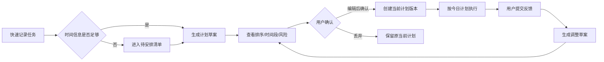

# Repland 竞品设计边界调研报告

> 版本：v1.0  
> 调研日期：2026-09-25  
> 适用产品：Repland Android 本地优先任务规划 MVP 及其后续 V1 设计  
> 报告目的：通过同类产品的功能、交互与 UI/UX 共性，确定 Repland 的必需品边界、暂不进入的边界，以及值得建立差异的设计空间。

## 1. 结论先行

Repland 不应把自己设计成“功能更多的待办清单”，也不应把 AI 设计成一个可以随意替用户改计划的聊天入口。它的核心定位应保持为：

> 在真实可用时间和用户确认的前提下，帮助用户决定下一步做什么、什么时候做，并在现实发生变化后可解释地继续推进。

竞品调研后的边界结论如下：

| 层级 | Repland 应达到的标准 |
| --- | --- |
| 功能必需品 | 快速记录任务、日期/截止日期/预计时长、今日执行、时间轴计划、手动调整、提醒、执行反馈、过载提示、计划草案确认、历史与回退 |
| 交互必需品 | 一步进入下一行动；列表与时间轴互相联动；拖拽可调整但不破坏硬约束；所有自动建议可预览、可编辑、可撤销；反馈输入足够轻量 |
| UI/UX 必需品 | 高信息密度但不拥挤；明确区分“当前计划”和“未确认草案”；优先级、风险、硬约束和执行状态具有稳定的视觉语义；关键动作满足无障碍和单手操作 |
| Repland 差异点 | 用户始终拥有最终确认权；硬约束和手动顺序受保护；任务完成/延期/取消不由 AI 推断；反馈会形成可检查、可修正、可回退的证据链；无 AI 或断网时核心闭环仍然成立 |
| 暂不追赶 | 协作、账号同步、外部日历双向同步、习惯系统、自由聊天式 AI、复杂标签/过滤 DSL、完整项目管理、装饰性统计 |

最重要的设计原则是：**竞品把“如何排进日历”做成能力，Repland 还要把“为什么这样排、改动会影响什么、由谁确认”做成产品体验。**

## 2. 项目事实基线

本报告不是从通用待办产品假设出发，而是以仓库中的产品文档和现有 Android UI 为基线。

### 2.1 产品定位

- 面向中文用户的 Android 单设备、本地优先任务规划应用。
- 重点用户是课程、学习、事务和休闲并行、容易在“想做什么”和“现实能做什么”之间失配的用户，尤其是刚进入大学的用户。
- 核心闭环为：录入任务 → 补充时间约束 → 生成计划草案 → 用户编辑/确认 → 执行反馈 → 生成调整草案 → 再次确认。
- 当前主要入口是“今日、任务、时间、我的”。
- 当前模型已经区分：任务、时间约束、计划草案、当前计划、计划版本、执行日志、任务状态、画像证据和受限 PlanningAgent。

### 2.2 已明确的不可突破边界

- AI、规则和系统不能自动完成、延期、取消或替换任务。
- 未确认草案不替换当前计划，也不创建提醒。
- 课程、休息、锁定时间段和“不可避免”任务是硬约束。
- 手动排序是当前用户意图，后续 AI 不能静默推翻。
- 反馈更正追加新记录，不能覆盖历史。
- AI 关闭、断网、超时或输出无效时，应用仍应使用本地确定性规划。

这些规则本身就是 Repland 的设计资产，不能为了模仿自动排程产品而削弱。

## 3. 竞品范围与调研方法

选择与 Repland 的核心功能最接近、且能代表不同设计取向的产品：

| 产品 | 代表的设计取向 | 本报告关注点 |
| --- | --- | --- |
| Todoist | 任务管理成熟、快速录入、日历/时间块逐步增强 | 任务对象、优先级、日期、过滤、手动时间块 |
| TickTick | 任务、日历、时间线、提醒和专注工具的一体化 | 移动端任务编辑、日历/时间线、拖拽和提醒 |
| Structured | 移动端以每日时间轴为核心的可视化规划 | 今日入口、Inbox、时间轴、拖拽排程、计划提醒 |
| Motion | 以自动排程为产品核心 | 时长/截止/优先级/可用时间的组合、动态重排 |
| Sunsama | 以每日规划仪式和可执行工作量为核心 | 每日计划、负载预估、延后、时间盒、实际耗时和复盘 |

调研只采用产品官网及官方帮助中心，结论来自官方公开的功能与操作说明，不把第三方宣传或用户传言作为产品事实。

## 4. 竞品共性功能矩阵

| 能力 | Todoist | TickTick | Structured | Motion | Sunsama | 对 Repland 的判断 |
| --- | --- | --- | --- | --- | --- | --- |
| 快速创建任务 | 有，支持快速添加和自然语言日期 | 有，支持快速添加、自然语言日期/时间和语音 | 有，强调快速创建和 Inbox | 有，创建时补充排程字段 | 有，支持直接添加、导入和 backlog | 必须有；当前最低创建信息不能被复杂表单阻塞 |
| 截止日期/日期 | 有 | 有 | 有 | 有，且参与自动排程 | 有 | 必须有；要区分“截止日期”和“实际工作时间” |
| 优先级 | P1–P4 | 高/中/低/无 | 有限度地通过时间轴表达 | ASAP/高/中/低 | 有任务优先级与排序 | 必须有；Repland 还要保留用户初始优先级与动态优先级的区分 |
| 预计时长 | 支持时间块时使用 | 支持任务时长 | 时间轴任务天然带时长 | 是自动排程的重要输入 | 是每日负载预测的重要输入 | 必须有；没有时长时允许保存，但不能伪造精确排程 |
| 日/周/月视图 | 有日历布局 | 有多种日历、议程、时间线视图 | 有日/周/月时间轴 | 日历是主界面 | 以每日视图和日历为主 | MVP 至少要有今日执行视图和时间轴；月视图可后置 |
| 拖拽排程 | 有，拖入日历会写入日期/时间/时长 | 有，拖拽调整时长和开始时间 | 有，Inbox 拖入时间轴 | 主要由系统自动安排 | 有，拖入日历完成时间盒 | 必须有手动调整；拖拽结果要有确认/撤销/风险提示语义 |
| 重复任务 | 有 | 有 | 有 | 有 | 有 | 是行业共性，但不应挤入当前 MVP；先验证单次任务闭环 |
| 提醒 | 有 | 有多种提醒和每日提醒 | 有规划/逾期提醒 | 与日历和排程关联 | 有计划、结束和仪式提醒 | 必须有，但只能作用于已确认计划 |
| 过载/容量判断 | 主要依赖用户规划 | 有统计，容量判断较弱 | 以时间轴可视化为主 | 自动找空档，强调按时完成 | 明确显示预计负载并警告超量 | 必须有；这是 Repland 将“计划可行性”显性化的机会 |
| 执行后的实际耗时 | 有限 | 有专注与统计 | 有完成/时间轴反馈 | 主要围绕计划执行 | 明确区分 planned time / actual time | 必须有；实际耗时要进入反馈和后续估时，但不能变成隐形评分 |
| 每日规划/复盘仪式 | 有周计划建议 | 有每日提醒和总结 | 有早间计划提醒 | 重点是自动排程 | 有完整 guided daily planning、shutdown 和 review | 必须有轻量版；不应强制用户走完整仪式 |
| 自动重排 | 非核心，用户手动调整 | 非核心，用户手动调整 | 非核心，用户手动调整 | 核心卖点，会因日历变化重排 | 支持自动排程和自动重排 | Repland 应做“生成调整草案”，而非默认静默重排 |
| 历史/回退 | 以任务完成、延期为主 | 有活动、完成和统计 | 有日程历史感知 | 以当前日历为主 | 可回看每日计划和执行时间 | 必须强化为版本化计划和追加式执行日志 |
| AI | 功能和过滤辅助逐步增加 | 提供 AI 功能 | 非核心 | 自动排程本身是智能能力 | Sunny 可创建/移动/完成任务并管理计划 | Repland 的 AI 权限范围必须比这类“代办式 AI”更窄、更可解释 |

## 5. 竞品带来的设计启示

### 5.1 Todoist：最低任务管理基线已经很高

Todoist 的官方文档显示，任务对象至少要能承载项目/列表、描述、优先级、日期、提醒、标签或过滤；其日历布局支持周/月视图、将无日期任务拖入日历、通过拖拽调整日期，并将时间块任务同步到外部日历。它把“记录”与“安排”分开，再用视图把两者连接起来。

对 Repland 的启示：

- 任务创建必须足够快，详细字段放在后续编辑，而不是第一次创建时全部要求。
- “无日期/待安排”不能是错误态，而应是可继续处理的明确状态。
- 列表排序和日历排程必须互相可见，不能维护两套互相矛盾的任务状态。
- 复杂过滤是规模化后的效率工具，不是 Repland MVP 的核心价值。当前可以先提供主动筛选的少量快捷视图，不要复制查询语言。

### 5.2 TickTick：多视图与拖拽已经成为成熟用户预期

TickTick 官方功能页和帮助中心强调了列表、看板、日历、议程、时间线、提醒、优先级、重复规则、专注和统计；时间线可以通过拖拽改变任务时长或开始时间，日历支持从时间轴位置直接新增任务。

对 Repland 的启示：

- 时间轴不是“展示页”，而要能直接完成新增、移动和调整。
- 任务详情需要容纳描述、预计时长、截止日期、优先级、反馈和历史入口，但默认只展示与当前决策相关的信息。
- 颜色可以辅助识别类别或状态，但不能同时把优先级、类别、风险、来源全部编码到颜色中。
- 统计要服务于“下一次计划更靠谱”，而不是堆积完成数量和连续天数。

### 5.3 Structured：移动端的核心是“今天能否一眼执行”

Structured 官方帮助中心把每日时间轴作为打开后的主要工作面，并将未安排任务放入 Inbox；用户可以把 Inbox 任务拖到时间轴空档。它区分时间轴任务、全天任务和重复任务，并提供周/月切换与计划提醒。

对 Repland 的启示：

- “今日”必须优先回答“现在/下一步做什么”，而不是先展示所有任务属性。
- 待安排任务要有稳定的收纳位置，不能因为没有精确时间而从今日体验中消失。
- 移动端应采用“时间轴 + 待安排列表”的双层结构，而不是把所有设置塞入一个滚动页面。
- 计划提醒应该是可关闭、可延后、可解释的辅助动作，不能把用户拉入强制流程。

### 5.4 Motion：自动排程的关键是输入质量与可解释性

Motion 官方帮助中心把可用时间、任务时长、截止日期、优先级和日历变化作为自动排程输入，并会在新增会议或变化后重新安排任务；它还支持任务拆分、暂停自动排程和自定义工作安排。

对 Repland 的启示：

- 如果要求用户提供预计时长，必须解释这个字段会影响什么；否则用户会认为它只是额外负担。
- 排程失败不能只显示“无法安排”，要明确是容量不足、硬约束冲突、截止日期不可达还是信息不足。
- 自动规划需要“暂停/锁定/手动调整”这些用户控制点。
- Repland 不应直接复制 Motion 的默认自动重排，因为本产品已经明确把“计划生效”放在用户确认之后；更合适的是“调整草案 + 影响摘要 + 用户确认”。

### 5.5 Sunsama：每日计划的价值在于限制过量承诺

Sunsama 官方文档把每日规划拆成：回顾前一天、加入今天任务、设置预计时间、检查预计负载、延后不重要任务、排序并可选时间盒、设置结束时间、记录障碍与总结。它还区分 planned time 和 actual time，并支持时间盒锁定与自动调整。

对 Repland 的启示：

- 每日回顾不应只是“完成了几个任务”，更应帮助用户判断今天是否超量、哪些任务需要重新取舍。
- 预计工作量与可用时间应在计划草案里直接对比。
- “延期”不能只是移动日期；需要让用户选择继续、拆分、降低目标、改期或放弃，并留下原因。
- 每日规划可以做成轻量入口，不应成为使用应用前的强制门槛。

## 6. Repland 的功能边界

### 6.1 P0：必须完成的核心边界

这些能力构成 Repland 相对于成熟待办/日历产品的最低可用闭环。

| 功能域 | 必需能力 | 设计验收标准 |
| --- | --- | --- |
| 快速记录 | 标题或描述、四类任务、初始优先级；截止日期、预计天数、预计总时长可选 | 只输入最少字段即可保存；详细信息可后补；信息不足时进入“待安排”而不是阻塞 |
| 任务详情 | 状态、描述、截止日期、预计/实际时长、进度、完成内容、结果、延期原因 | 用户打开任务后能理解“要做什么、为什么现在做、还剩什么、上次发生了什么” |
| 今日执行 | 当前计划工作段、下一项、待确认工作段、其他活跃任务、每日回顾入口 | 打开今日页后 3 秒内能找到下一步；待确认事项不能被普通任务淹没 |
| 计划生成 | 任务顺序、可用时间、课程/休息/锁定时间、不可避免任务、截止日期、预计时长 | 生成结果有排序理由、可行性和缺失信息提示；不够信息时只生成清单排序 |
| 草案确认 | 查看差异、编辑顺序/工作段、确认、丢弃、继续沿用当前计划 | 草案和当前计划视觉上明确分层；未确认草案不会改变提醒和执行依据 |
| 手动调整 | 长按拖动顺序、调整工作段、锁定时间段、主动创建并行安排 | 手动调整立即反馈；潜在风险只警告不阻断；可撤销或回到草案 |
| 执行反馈 | 开始、完成、部分完成、延期、取消、替换、恢复；填写完成内容、实际时长、进度和结果 | 状态由用户确认；部分完成保留剩余工作；更正不会覆盖旧记录 |
| 重规划 | 根据反馈、新任务和约束生成调整草案 | 只展示受影响任务、变动前后和原因；用户确认后才形成新计划版本 |
| 提醒 | 工作段开始、临近截止、每日回顾；只对已确认计划生效 | 草案、失效版本和无具体时间任务不会误发提醒；可关闭且不影响核心功能 |
| 历史与回退 | 计划版本、执行日志、日志更正、版本恢复 | 回退创建新版本，不删除后续日志；用户可追溯为什么改变 |
| 离线与降级 | 本地确定性排序与排程、AI 开关、请求预览、失败原因 | 无 AI/断网时仍能完成任务录入、规划、确认和反馈 |

### 6.2 P1：验证核心闭环后再进入

- 单次任务的轻量子任务/步骤拆分。
- 任务搜索和少量快捷筛选：今日、逾期、待安排、待确认、不可避免。
- 每周视图和一周负载概览。
- 任务重复规则，优先覆盖课程/固定事务验证后的高频重复工作。
- 轻量专注计时器或工作段内计时，必须与实际反馈绑定。
- 以真实反馈为依据的估时偏差提示，例如“最近同类任务通常比预计多用 30 分钟”。
- 可解释的画像证据浏览，而非泛化的“效率评分”。

### 6.3 P2：明确暂不追赶的边界

- 账号、云同步、跨设备和团队协作。
- Google/Outlook/Apple 日历双向同步。
- 完整项目/目标/里程碑层级。
- 独立习惯打卡、连续天数、游戏化激励。
- 自由聊天式 AI、全局 AI 代办、自动完成和自动改状态。
- 面向高级用户的标签体系、复杂过滤表达式、看板和甘特图。
- 月度/学期压力看板、生产力分数、过度丰富的统计仪表盘。

判断依据：这些功能在竞品中普遍存在，但它们解决的是规模化管理、跨工具整合或长期激励问题，不能替代 Repland 当前尚未验证完的“计划是否可执行、反馈是否真实、调整是否可信”。

## 7. Repland 的交互边界

### 7.1 关键任务流

### 7.2 交互必需规则

#### A. 创建任务：先捕获，再补全

- FAB 或底部输入应直接进入标题/描述输入，不先打开大表单。
- 创建时只要求标题或描述、类别、初始优先级。
- 截止日期、预计时长、预计天数使用渐进式补全。
- 输入后要立即告诉用户当前状态：例如“已保存，等待安排”“将在今天 19:00–19:30 处理”“缺少可用时间，暂不安排具体时段”。
- 有自然语言识别时只能作为建议，识别出的日期/时长要可见、可修改、可撤销。

#### B. 今日页：先行动，再管理

今日页建议固定为以下顺序：

1. 顶部日期与今日负载：已安排时长 / 可用时长 / 风险状态。
2. 当前或下一工作段：任务名、时间、剩余工作和主操作。
3. 待确认工作段：明显标注“请确认完成情况”，提供完成/部分完成/延期三个快速入口。
4. 今日时间轴或顺序列表。
5. 待安排、逾期和其他活跃任务。
6. 每日回顾。

不要把今日页设计成“所有活跃任务按创建时间排列”的列表；那会退化成普通 Todo 应用，无法体现 Repland 的计划价值。

#### C. 计划草案：展示变化，而不是只展示结果

草案页至少显示：

- 当前计划与新草案的版本标识。
- 新增、移动、拆分、延后、保留的任务。
- 受影响的工作段和预计时间变化。
- 产生变化的原因：新任务、截止临近、容量不足、反馈偏差或约束变化。
- 硬约束和手动锁定段的保护状态。
- “确认草案”“编辑后确认”“丢弃”三个明确动作。

推荐用“变更摘要 + 可编辑列表/时间轴”结构；不要让用户在一个长对话框里阅读所有推理过程。

#### D. 时间轴：直接操作，但不直接越权

- 点击空档可新增时间段；拖拽可改变时间；长按可移动任务。
- 手动移动后立即显示结果和风险，不要求用户先进入设置。
- 与课程、休息、锁定段重叠时，显示“冲突”而不是直接拒绝；用户主动创建并行安排时，记录为手动并行覆盖。
- 自动生成的调整必须先进入草案，不能因为用户拖动了一项就把全局计划静默重排。
- 时间信息不足时，以“待安排”收纳，不用默认空闲填满日历。

#### E. 执行反馈：完成路径最短，复盘信息可追加

- 结束工作段后，先提供“完成 / 部分完成 / 延期”三选一。
- 点击“完成”后优先要求最小必要的“完成了什么”；实际时长、进度、结果为可选补充。
- 点击“部分完成”直接显示剩余工作，避免重新创建任务。
- 点击“延期”要给出继续、拆分、改期、降低目标、放弃等明确决策，而不只是一个日期选择器。
- 所有反馈都可从任务详情进入历史记录更正，但更正要显示原记录和新记录。

#### F. AI：建议入口，不是万能入口

- AI 入口应附着在任务详情、草案和每日回顾这些上下文中。
- 每次请求先展示“将发送什么、用于什么、影响哪些任务”。
- AI 结果分为建议、解释和草案三类；三者不可混成“AI 已完成”。
- 只有用户明确授权的当前冲突范围可以由 AI 做取舍；授权不扩散到其他任务、状态或设置。
- AI 失败时保留原始输入并给出本地规划结果，不展示空白页或泛化错误。

### 7.3 现有四个主入口的设计调整

| 当前入口 | 建议定位 | 需要补强的交互 |
| --- | --- | --- |
| 今日 | 行动中心 | 顶部先显示下一步、负载、待确认和风险；每日回顾从这里进入 |
| 任务 | 任务收集与详情 | 保留活跃/历史切换；增加待安排、逾期、待确认快捷筛选；创建保持轻量 |
| 时间 | 约束与计划 | 不只展示每周时间块和例外；要同时提供“可用时间、当前计划、草案预览”的关系 |
| 我的 | 设置与证据 | 将提醒、AI、类别偏好、画像、数据管理做分组和折叠；避免长页面连续滚动 |

## 8. UI/UX 设计边界

### 8.1 信息层级

Repland 的视觉优先级应固定为：

1. 现在要做什么。
2. 什么时候做、预计多久。
3. 是否可行、有什么风险。
4. 用户需要确认什么。
5. 为什么这样安排。
6. 任务的完整历史和高级属性。

标题、下一步动作和时间信息要比类别权重、AI 解释或统计数字更突出。用户进入页面的第一眼不应该先看到“模型建议了什么”，而应该看到“我下一步能做什么”。

### 8.2 组件边界

建议沉淀以下共享组件，保证四个入口行为一致：

| 组件 | 用途 | 必备状态 |
| --- | --- | --- |
| `TaskRow` | 今日、任务、草案共用的任务行 | 待开始、进行中、逾期、待安排、已完成、已锁定 |
| `ScheduleSegment` | 时间轴工作段 | 普通、课程/休息、锁定、固定、冲突、待确认 |
| `PlanChangeSummary` | 草案变更摘要 | 新增、移动、拆分、延后、保留、不可行 |
| `CapacityBanner` | 今日/草案负载提示 | 可行、接近上限、超量、缺少时长、截止不可达 |
| `FeedbackSheet` | 工作段结束后的快速反馈 | 完成、部分完成、延期、取消、替换 |
| `EvidenceRow` | 画像证据和执行日志 | 来源、时间、原记录、更正状态 |
| `ConstraintChip` | 硬约束和手动保护提示 | 课程、休息、锁定、不可避免、手动覆盖 |

### 8.3 视觉语义

- 主色只表达主要行动、当前选中或需要用户处理的重点，不要把每个卡片都染成强调色。
- 绿色表达“已确认/已完成”，橙色表达“需要确认/接近风险”，红色表达“不可行/冲突/错误”；不要用颜色表达普通类别以外的多重含义。
- “当前计划”和“未确认草案”必须有稳定差异：例如当前计划使用正常 surface，草案使用带边框或轻微强调色，并固定显示“未确认”标签。
- 硬约束使用图标 + 文案 + 边界线表达，不能只靠灰色或颜色猜测。
- 任务类别颜色可作为辅助，但任务状态、风险和确认状态必须有非颜色表达。

### 8.4 布局与可用性下限

- 交互目标建议不小于 48dp；拖拽区、完成按钮和冲突处理按钮要有足够触控面积。
- 今日任务行建议使用紧凑列表而不是全部大圆角卡片；卡片用于状态分组、负载提示和草案摘要。
- 时间轴上同时出现多个连续工作段时，用统一刻度和间距表达节奏，避免每个任务使用不同高度导致时间感失真。
- 长文本、任务描述和 AI 建议默认折叠；详情页再展开。
- 页面加载、空状态、无时间信息、排程失败、无 AI、无通知权限都必须有可行动的下一步。
- 重要操作需要可撤销或可回退；删除、清除本地数据和取消任务要与普通编辑动作明确区分。
- 所有状态不能只通过颜色或图标表达；必须同时有文字或可访问性描述。

### 8.5 对当前实现的具体 UI 建议

1. 当前底部导航用文字首字母作为图标，建议替换为有语义的 Material 图标，并保留文字标签；“今日/任务/时间/我的”四项不需要增加第五个入口。
2. 当前 `TodayScreen` 已区分计划段、待确认段和其他活跃任务，应继续强化为“下一步 + 负载 + 待确认 + 其他任务”的结构，而不是继续增加卡片字段。
3. 当前 `TimeScreen` 将时间块、日期例外、课表导入、生成草案和计划总览放在同一滚动页面；建议在视觉上分为“我的时间约束”和“当前计划/草案”两个区块，并让草案入口更靠近计划摘要。
4. 当前 `MineScreen` 同时承载提醒、AI、类别偏好、画像和数据管理；建议改为分组列表或折叠区，首屏只保留提醒、AI 开关和最常用设置。
5. 当前大量页面使用 18–20dp 大圆角卡片，建议保留在模块容器和重要状态上，普通任务行降低卡片感，提高一屏可扫描数量。
6. 当前草案、AI 请求预览和任务反馈已经采用对话框路径；当内容超过一屏时，应优先改为底部抽屉或全屏编辑页，避免在小屏幕上嵌套滚动对话框。

## 9. 建议的设计优先级

### 第一阶段：把核心闭环设计稳定

- 今日页信息层级和下一步操作。
- 任务快速创建和待安排状态。
- 当前计划 / 未确认草案的视觉与交互区分。
- 时间轴直接编辑、冲突提示和撤销。
- 工作段结束后的三选一反馈。
- 计划可行性提示和受影响任务摘要。

### 第二阶段：提升计划可信度

- 每周负载视图。
- 待安排、逾期、待确认快捷筛选。
- 计划版本差异查看和回退入口。
- 预计时长与实际时长的偏差反馈。
- 轻量每日规划/复盘入口。

### 第三阶段：在数据证明需要后扩展

- 重复任务。
- 子任务和项目/目标层级。
- 外部日历或课程系统同步。
- 跨设备与账号。
- 更丰富的统计、习惯和 AI 自动化。

## 10. 设计评审清单

每一个新增功能或页面，在进入开发前至少回答以下问题：

- 它是否帮助用户更快确定“下一步做什么”？
- 它是否把任务状态、时间安排、计划版本和执行反馈混为一谈？
- 它是否会在没有用户确认时改变当前计划、提醒或任务状态？
- 它是否明确区分硬约束、软建议和用户手动决定？
- 没有预计时长、没有可用时间或没有 AI 时，页面是否仍然可用？
- 用户能否看到这次调整影响了哪些任务以及为什么？
- 用户是否能撤销、回退或更正这次操作？
- 在手机小屏幕和单手操作下，主要动作是否足够明显？
- 这个功能是核心闭环必需，还是只是竞品已经有所以想跟进？

如果最后一个问题的答案只是“竞品有”，则默认进入 P1/P2，而不是直接进入 MVP。

## 11. 调研来源

以下均为官方产品页或官方帮助中心，访问日期：2026-09-25。

- [Todoist：Use the calendar layout](https://www.todoist.com/help/todoist/features/use-the-calendar-layout-in-todoist-lPHRQTu0o)
- [Todoist：Time blocking](https://staging.todoist.com/help/articles/time-blocking-in-todoist-d6Pf1uTpc)
- [Todoist：Calendar integration](https://www.todoist.com/help/articles/use-the-calendar-integration-rCqwLCt3G)
- [Todoist：Filters](https://www.todoist.com/help/todoist/features/introduction-to-filters-V98wIH)
- [TickTick：Features](https://ticktick.com/features)
- [TickTick：Task details](https://help.ticktick.com/articles/7055782408586526720)
- [TickTick：Calendar](https://help.ticktick.com/articles/7063851189372190720)
- [Structured：Getting started](https://help.structured.app/en/articles/380546)
- [Structured：Create, edit & delete tasks](https://help.structured.app/en/articles/338050)
- [Structured：Planning reminders](https://help.structured.app/en/articles/9179330)
- [Motion：Auto-scheduling](https://www.usemotion.com/help/time-management/auto-scheduling)
- [Motion：Auto-scheduling how-to guide](https://www.usemotion.com/help/time-management/auto-scheduling/auto-scheduling-how-to-guide)
- [Sunsama：Daily planning basics](https://help.sunsama.com/docs/getting-started/basics/daily-planning-the-basics/)
- [Sunsama：Daily planning](https://help.sunsama.com/docs/usage-guides/daily-planning/)
- [Sunsama：Timeboxing basics](https://help.sunsama.com/docs/getting-started/basics/timeboxing-the-basics/)
- [Sunsama：Planned and actual times](https://help.sunsama.com/docs/usage-guides/tasks/planned-and-actual-times/)
- [Sunsama：Timeboxing](https://www.sunsama.com/features/timeboxing)

